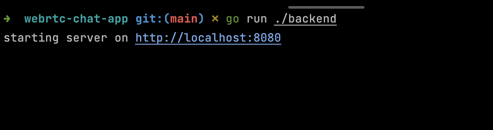
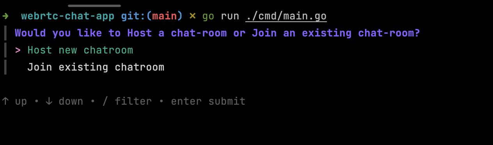
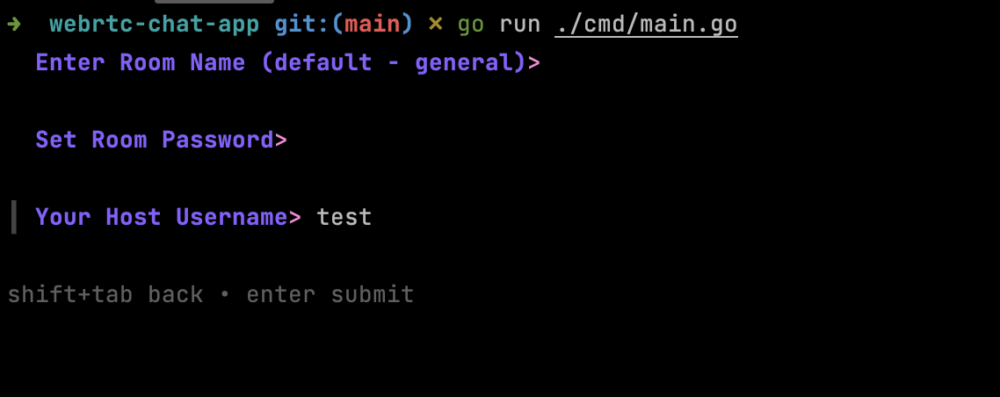
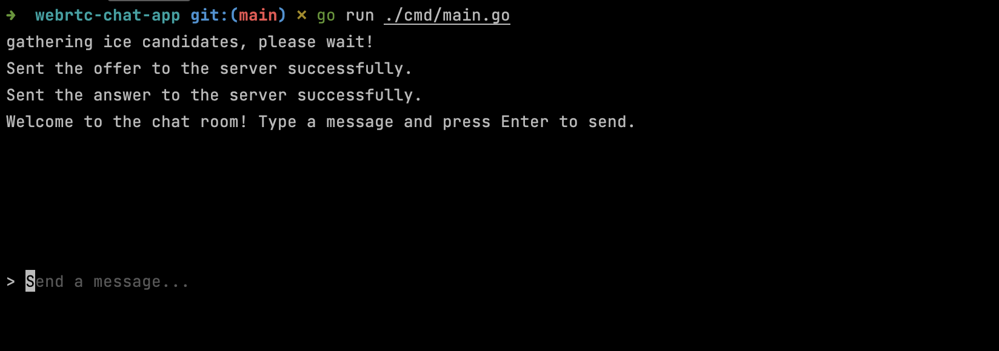
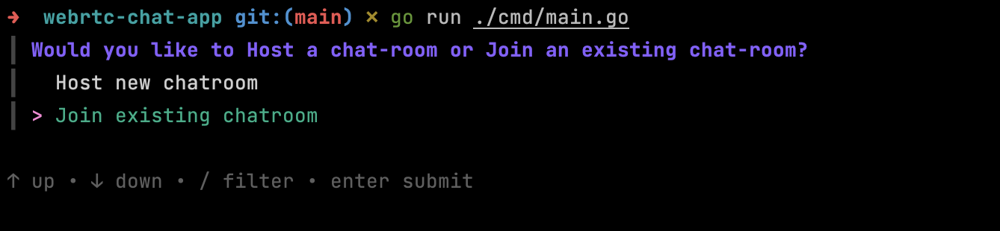
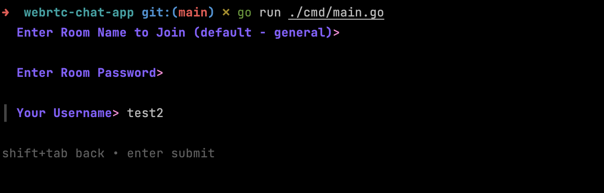
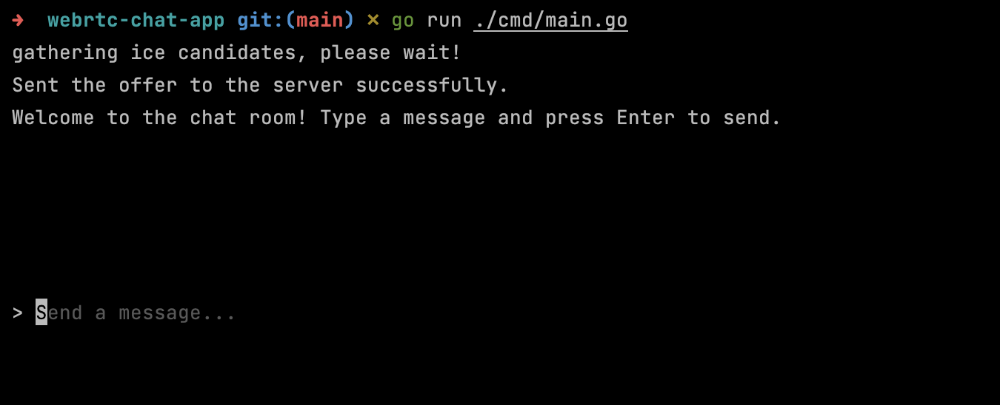
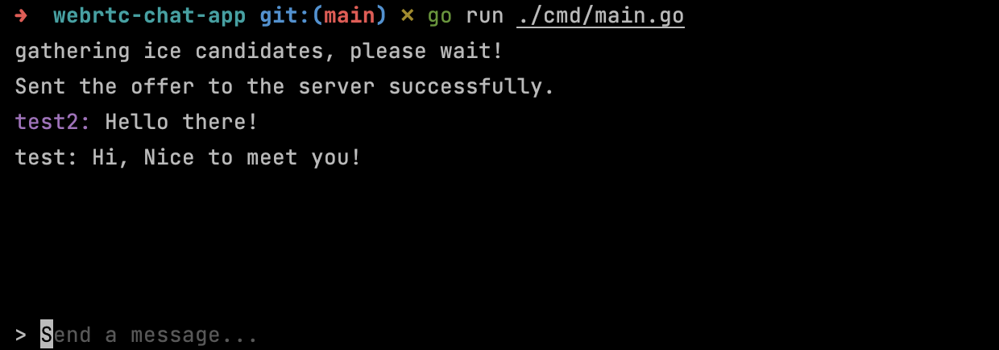

# Chat App (WebRTC + Golang + BubbleTea)

## Introduction

- This project uses [BubbleTea](https://github.com/charmbracelet/bubbletea) for the UI.
- You can install it with `go get github.com/charmbracelet/bubbletea`.

## Setup

- You need to run `go mod tidy` to install the dependencies.
- Run `go run ./backend` to start the backend signalling server.
- Run `go run ./cmd/main.go` to start the room and chat.

## Usage

> Run Backend

> Start chat

> Host room

> Room welcome

> Peer joining

> Peer configuration

> Peer window

> Chat Window (with history)

